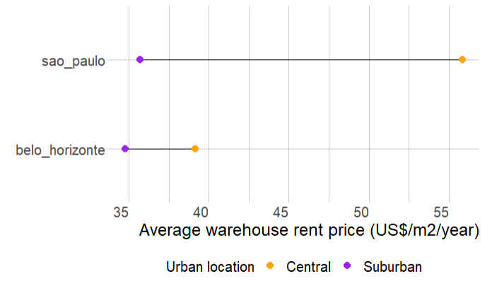

```{r child = "setup.Rmd"}
```

```{r xaringan-scribble, echo=FALSE}
xaringanExtra::use_scribble()
```


```{r message=FALSE, warning=FALSE, include=FALSE}
library(tidyverse)
library(fontawesome) # from github: https://github.com/rstudio/fontawesome
library(plotly)
library(htmltools)
```


name: xaringan-title
class: left, middle
background-image: url(img/log7.jpg)
background-size: cover

.larger[
.off-white[
.center[

Relações entre características urbanas, mercado imobiliário de armazéns e a localização dos armazéns
]
]]

.large[
.off-white[
.bold[
.center[
Regiões metropolitanas dos EUA, São Paulo e Belo Horizonte
]]]]

<br><br>
.large[
.off-white[
Renata Oliveira

Reunião ABRALOG - 13/09/2022  
]]

---

### Autores

```{r echo=FALSE, fig.align='center', message=FALSE, warning=FALSE, out.width='90%'}
knitr::include_graphics('img/banner.png')
```

.center[
.large[
Renata Oliveira   
Laetitia Dablanc   
Matthieu Schorung     

]
]

---

### Hipóteses de pesquisa


.large[
A **localização de armazéns** está relacionada ao **preço praticado pelo mercado imobiliário** em locação de instalações logísticas.

]

.large[
**O espraiamento logístico é maior** nas cidades com um elevado diferencial do **preço da terra** entre **áreas centrais e suburbanas**.
]

.big[
(Dablanc, L., 2019)
]

---

### Desafios metodológicos

.large[
- **Compatibilização** de **métodos** e **dados** para **comparação** de contextos metropolitanos muito diversos

- Coleta de **dados não estruturados**

- Determinação de **centralidades urbanas** para análise da **localização de armazéns** e das **práticas do mercado imobiliário**
]

???


POI + road lenght  = UAI = Openstreetmap - dados colaborativos
Real estate = Loopnet

---

### Espraiamento logístico

```{r echo=FALSE, message=FALSE, warning=FALSE, out.width="60%", fig.align='center'}

```

???

Definir espraiamento logístico

---


```{r echo=FALSE, message=FALSE, warning=FALSE, out.width="100%", fig.align='center'}

```

???

Espraiamento logístico

Algumas cidades apresentaram concentração espacial no período para o qual foram coletados os dados. 

- é possível afirmar que SP não apresenta espraiamento entre as datas de coleta (verificar) e que BH apresenta espraiamento. 

- San diego, Seattle, Virginia beach, Saint Louis, Greenville, Greensboro, Tucson apresentaram concentração espacial de armazéns no tempo. 


---

### Dados espacializados e apropriados aos hexágonos

.pull-left[
```{r echo=FALSE, message=FALSE, warning=FALSE, out.width="100%", fig.align='center'}

```
]

.pull-right[
```{r echo=FALSE, message=FALSE, warning=FALSE, out.width="100%", fig.align='center'}

```

]

---

### Diferenças do preço médio de locação de armazéns entre áreas centrais e áreas menos centrais

```{r echo=FALSE, message=FALSE, warning=FALSE, out.width="60%", fig.align='center'}

```

???

UAI - soma da concentração de POI e km de vias normalizadas
Central == 5% das observações
Suburban = 95%

Fizemos vários testes para chegarmos nessa diferenciação. 


---


```{r echo=FALSE, message=FALSE, warning=FALSE, out.width="90%", fig.align='center'}

```


???

Há regiões metropolitanas nos EUA que apresentam preços mais elevados de locação nas áreas suburbanas do que nas áreas centrais

---

### Hipótese 1: RMSP e RMBH

.center[
A **localização de armazéns** está relacionada ao **preço praticado pelo mercado imobiliário** em locação de instalações logísticas.

]

.pull-left[
```{r echo=FALSE, message=FALSE, warning=FALSE, out.width="75%", fig.align='center'}

```
]

.pull-right[
```{r echo=FALSE, message=FALSE, warning=FALSE, out.width="75%", fig.align='center'}
knitr::include_graphics("img/br/discrete_2.png")
```
]

---

### Hipótese 1: RMSP e RMBH
.center[
A **localização de armazéns** está relacionada ao **preço praticado pelo mercado imobiliário** em locação de instalações logísticas.
]

.pull-left[
```{r echo=FALSE, message=FALSE, warning=FALSE, out.width="75%", fig.align='center'}

```
]

.pull-right[
**Pearson's Chi-squared test with simulated p-value**   
(based on 2000 replicates) 

Chi^2 =  5.893232 (p =  0.06)

Chi^2 =  4.630295 (p =  0.10) 

Chi^2 =  4.764275 (p =  0.13) 

.big[.center[
Em um nível de significância de 5%, conclue-se que a **localização dos armazéns, sua frequência nas regiões e o preço de locação não estão estatisticamente relacionados**.
]]
]

???

As variáveis são independentes - não apresentam correlação. 

Is the p-value less than .05?  If so, we can conclude that the variables are not independent of each other and that there is a statistical relationship between the categorical variables.

---

### Hipótese 1: RM dos EUA 

.center[
A **localização de armazéns** está relacionada ao **preço praticado pelo mercado imobiliário** em locação de instalações logísticas.
]

.pull-left[
```{r echo=FALSE, message=FALSE, warning=FALSE, out.width="100%", fig.align='center'}

```
]

.pull-right[
```{r echo=FALSE, message=FALSE, warning=FALSE, out.width="100%", fig.align='center'}

```
]

---

### Hipótese 1: RM dos EUA 

.center[
A **localização de armazéns** está relacionada ao **preço praticado pelo mercado imobiliário** em locação de instalações logísticas.
]

.pull-left[
```{r echo=FALSE, message=FALSE, warning=FALSE, out.width="90%", fig.align='center'}

```
]

.pull-right[
**Pearson's Chi-squared test with simulated p-value**   
(based on 2000 replicates) 

Chi^2 =  117.08 (p = 0.0005)

Chi^2 =  13.96 (p =  0.0005) 

Chi^2 =  49.09 (p =  0.0005) 


Considerando regiões metropolitanas dos **EUA**, em um nível de significância de 5%, conclue-se que a **localização dos armazéns, sua frequência nas regiões e o preço de locação são estatisticamente relacionadas.**
]

---

### Hipótese 2:


O **espraiamento logístico** é **maior** nas cidades com um **elevado diferencial** do **preço da terra** entre áreas centrais e suburbanas


.pull-left[
**São Paulo:** 
- **Não apresenta espraiamento logístico** e   
- apresenta **preços médios de locação de armazéns mais elevados nas áreas centrais**

**Belo Horizonte:** 
- Apresenta **espraiamento logístico positivo** e 
- apresenta **preços médios de locação de armazéns mais elevados nas áreas centrais**
]


.pull-right[
```{r echo=FALSE, fig.align='center', message=FALSE, warning=FALSE, out.width="70%"}

```
]

---

### Hipótese 2:

O **espraiamento logístico** é **maior** nas cidades com um **elevado diferencial** do **preço da terra** entre áreas centrais e suburbanas

```{r echo=FALSE, message=FALSE, warning=FALSE, out.width="80%", fig.align='center'}
knitr::include_graphics("img/12_abralog.png")
```


---

### Resultados

.large[

Para as RM dos EUA, a **localização** e os **preços de locação dos armazéns** estão relacionados à **densidade da atividade urbana**. Essa afirmativa não é válida para as RM brasileiras investigadas. 

Tanto para as RM dos EUA como as brasileiras, o **espraiamento logístico** **não está** significativamente **relacionado** com o **diferencial nos preços locação de armazéns** em **áreas centrais** e **suburbanas**.
]

???
Há evidências estatisticamente significativas de que a localização dos armazéns e os preços médios de aluguel não são independentes.

Considerando todas as regiões metropolitanas, identificamos que o diferencial de valores locação nas áreas central e suburbana não está relacionada ao espraiamento logístico anual. 

Regarding the first hypothesis, which aimed at investigating whether warehouse rent prices were higher in more central places within metropolitan areas, we can state that there is statistically significant evidence that the location of warehouses and average rent prices are not independent. 
We explore the correlation between the differential of rent values in central and suburban areas; and yearly logistics sprawl (second hypothesis). Considering all metropolitan regions, we identify that the null hypothesis (the relationship is not significant) cannot be rejected

Nevertheless, since the metropolitan areas are significantly different in many dimensions, this statement cannot be generalized when we gather them into more similar groups. 

Finally, we conclude that: (i) it is essential to classify metropolitan areas into a typology to perform comparative studies; (ii) warehouse location and prices are related to the density of urban activity; (iii) logistics sprawl is not significantly related to the differential in warehouse rental prices in central and suburban areas, but there are major differences among metropolitan categories. 


---

### Trabalhos Futuros

.large[
- Classificar as áreas metropolitanas em uma **tipologia** para realizar estudos **comparativos**

- Expandir a análise para outras regiões metropolitanas brasileiras

- Melhorar as bases de dados sobre práticas de preços no mercado imobiliário, buscando contemplar os armazéns atualmente locados. 

- Investigar a concentração urbana em áreas centrais das instalações logísticas e seus impactos no contexto urbano, contrapondo o fenômeno do espraiamento logístico. 

]

---

### Contribuições da pesquisa

.large[
**Metodológica:** estrutura inovadora para comparar regiões metropolitanas considerando o padrão espacial das instalações logísticas e as características urbanas. 

**Reprodutibilidade**

**Política pública:** Pode induzir as autoridades públicas locais e regionais ao planejamento integrado, considerando necessidades da população, do mercado imobiliário e as determinações de uso do solo. 
]

???

a desenvolver políticas públicas mais eficazes voltadas para o uso do solo e o planejamento do transporte orientadas à DUM. A coordenação destas dimensões é essencial para apoiar as necessidades de soluções de logística urbana, de habitabilidade das cidades, de qualidade de vida, do acesso equitativo a bens de consumo e do mercado imobiliário. 

---

### Referências

.midi[
  
[1]	L. Dablanc, D. Rakotonarivo, The impacts of logistics sprawl: How does the location of parcel transport terminals affect the energy efficiency of goods’ movements in Paris and what can we do about it?, Procedia - Soc. Behav. Sci. 2 (2010) 6087–6096. https://doi.org/10.1016/j.sbspro.2010.04.021.
[2]	L. Dablanc, S. Ogilvie, A. Goodchild, Logistics sprawl, Transp. Res. Rec. 2410 (2014) 105–112. https://doi.org/10.3141/2410-12.   
[3]	L. Dablanc, M. Browne, Introduction to special section on logistics sprawl, J. Transp. Geogr. (2019) 0–1. https://doi.org/10.1016/j.jtrangeo.2019.01.010.   
[4]	A. Heitz, L. Dablanc, L.A. Tavasszy, Logistics sprawl in monocentric and polycentric metropolitan areas: the cases of Paris, France, and the Randstad, the Netherlands, REGION. 4 (2017) 93. https://doi.org/10.18335/region.v4i1.158.   
[5]	J. Cidell, Concentration and decentralization: The new geography of freight distribution in US metropolitan areas, J. Transp. Geogr. 18 (2010) 363–371. https://doi.org/10.1016/j.jtrangeo.2009.06.017.   
[6]	T. Sakai, A. Beziat, A. Heitz, Location factors for logistics facilities: Location choice modeling considering activity categories, J. Transp. Geogr. 85 (2020) 102710. https://doi.org/10.1016/j.jtrangeo.2020.102710.   
[7]	OpenStreetMap contributors, Planet dump retrieved from https://planet.osm.org , (2017).   
[8]	S. Shekhar, H. Xiong, Local Indicators of Spatial Association Statistics, Encycl. GIS. 116 (2008) 615–615. https://doi.org/10.1007/978-0-387-35973-1_701. ]
---

# Referências

.midi[
[9]	A. Luc, Spatial econometrics: methods and models, Kluwer Academic., Dordrecht, 1988.   
[10]	R.H.M. Pereira, V. Nadalin, L. Monasterio, P.H.M. Albuquerque, Urban Centrality: A Simple Index, Geogr. Anal. 45 (2013) 77–89. https://doi.org/10.1111/gean.12002.   
[11]	A. Regal, J. Gonzalez-Feliu, M. Rodriguez, M. Juganaru-Mathieu, Defining urban logistics profile zones in South American metropolis by combining functional and spatial clustering techniques, 2019 Int. Conf. Control. Autom. Diagnosis, ICCAD 2019 - Proc. (2019) 1–6. https://doi.org/10.1109/ICCAD46983.2019.9037890.   
[12]	Y. Wang, C. Hao, D. Liu, The spatial and temporal dimensions of the interdependence between the airline industry and the Chinese economy, J. Transp. Geogr. 74 (2019) 201–210. https://doi.org/10.1016/j.jtrangeo.2018.11.020.   
]


---

class: middle

.pull-left[
```{r echo=FALSE, message=FALSE, warning=FALSE, out.width="30%"}
knitr::include_graphics("img/reta_atual.jpeg")
```
]


.pull-right[
.larger[
.center[
Obrigada!
]]
]

<hr />

&nbsp;

<p style="text-align: center;"><span style="color: #852380;"><em>renataoliveira@gmail.com</em></span></p>

<!-- Add icon library -->
<link rel="stylesheet" href="https://cdnjs.cloudflare.com/ajax/libs/font-awesome/4.7.0/css/font-awesome.min.css">

<link rel="stylesheet" href="https://cdn.jsdelivr.net/gh/jpswalsh/academicons@1/css/academicons.min.css">


<!-- Add font awesome icons -->
<p style="text-align: center;">
    <a href="https://twitter.com/retaoliveira?lang=en" class="fa fa-twitter fa-2x"></a>&nbsp;&nbsp;
    <a href="https://github.com/retaoliveira" class="fa fa-github fa-2x"></a>&nbsp;&nbsp;
    <a href="https://scholar.google.com/citations?user=V6EX45EAAAAJ" class="ai ai-google-scholar ai-2x"></a>&nbsp;&nbsp;
    <a href="https://orcid.org/0000-0002-9011-2342" class="ai ai-orcid ai-2x"></a>&nbsp;&nbsp;
    <a href="http://lattes.cnpq.br/2642488704355833" class="ai ai-lattes ai-2x"></a>&nbsp;&nbsp;
    <a href="https://github.com/retaoliveira/relements/raw/main/texto/index.pdf" class="ai ai-cv ai-2x"></a>

</p>

&nbsp;
